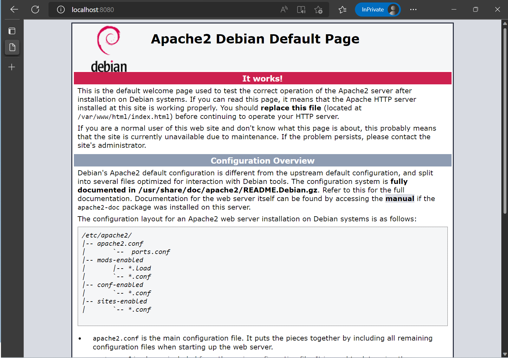

# Webserver Apache2 Sample
<br/>

## Container Build
<br/>

```
docker image build -t kledsonhugo/apache2:1.0.0 . --no-cache
```
<br/>

- Output example

  ```
  $ docker image build -t kledsonhugo/apache2:1.0.0 . --no-cache
  [+] Building 30.1s (6/6) FINISHED
   => [internal] load build definition from Dockerfile                             0.0s
   => => transferring dockerfile: 38B                                              0.0s 
   => [internal] load .dockerignore                                                0.0s 
   => => transferring context: 2B                                                  0.0s 
   => [internal] load metadata for docker.io/library/debian:latest                10.9s 
   => CACHED [1/2] FROM docker.io/library/debian@sha256:e538a2f0566efc44db215032   0.0s
   => [2/2] RUN apt-get update && apt-get install -y apache2 && apt-get clean     18.4s 
   => exporting to image                                                           0.7s
   => => exporting layers                                                          0.7s
   => => writing image sha256:458cdbbd44af09aa4eec2b9a74e042aa653a236a34fb41dff6   0.0s
   => => naming to docker.io/kledsonhugo/apache2:1.0.0                             0.0s
  $
  ```
<br/>

## Container Run
<br/>

```
docker run -d -p 8080:80 kledsonhugo/apache2:1.0.0
```
<br/>

- Output example

  ```
  $ docker run -d -p 8080:80 kledsonhugo/apache2:1.0.0
  6faa6008072bf3563a131da58d10acbd68b7f55a3d82d8f9f1061c74d574398f
  $
  ```
<br/>

- Check container execution
<br/>

  ```
  $ docker ps -a |grep apache2
  6faa6008072b   kledsonhugo/apache2:1.0.0   "/usr/sbin/apachectl…"   About a minute ago   Up About a minute   0.0.0.0:8080->80/tcp   reverent_bhabha
  $
  ```
<br/>

- Test if Apache2 is running
<br/><br/>

  1. Open browser.
  <br/><br/>
  2. Navigate to [localhost:8080](localhost:8080).
  <br/><br/>
  3. See Apache2 main page.
  <br/><br/>
     