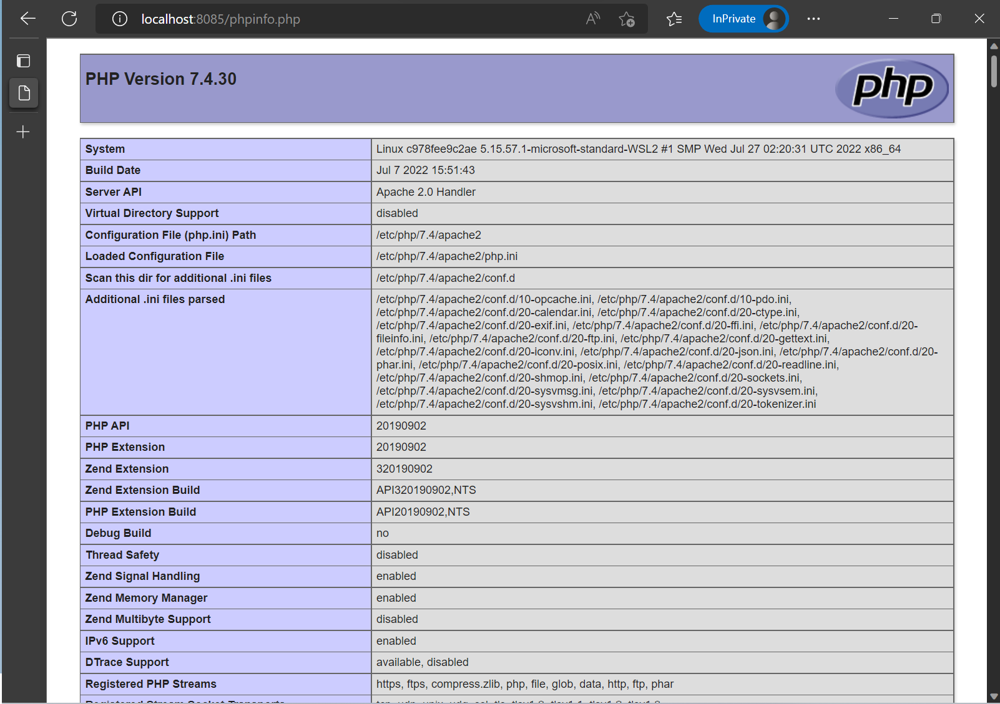

# PHP Info Sample

## Container Build

```
docker image build -t kledsonhugo/php-info:1.0.0 . --no-cache
```

- Output example

  ```
  $ docker image build -t kledsonhugo/php-info:1.0.0 . --no-cache
  [+] Building 21.3s (8/8) FINISHED
   => [internal] load build definition from Dockerfile                              0.0s
   => => transferring dockerfile: 511B                                              0.0s
   => [internal] load .dockerignore                                                 0.0s
   => => transferring context: 2B                                                   0.0s
   => [internal] load metadata for docker.io/library/debian:latest                  0.0s 
   => [internal] load build context                                                 0.0s 
   => => transferring context: 88B                                                  0.0s 
   => CACHED [1/3] FROM docker.io/library/debian                                    0.0s 
   => [2/3] RUN apt-get update && apt-get install -y apache2 php && apt-get clean  20.4s 
   => [3/3] COPY app/*.php /var/www/html/                                           0.0s
   => exporting to image                                                            0.8s
   => => exporting layers                                                           0.8s
   => => writing image sha256:f6d1fff5444e46cc351cbe2cb8c4f749ba30fe57c6b2          0.0s
   => => naming to docker.io/kledsonhugo/php-info:1.0.0                             0.0s
  $
  ```

## Container Run

```
docker run -d -p 8085:80 kledsonhugo/php-info:1.0.0
```

- Output example

  ```
  $ docker run -d -p 8085:80 kledsonhugo/php-info:1.0.0
  c978fee9c2aedf169e9071635b621dfe4cbfe953334f335ee43913e18894d6ee
  $
  ```

- Check container execution

  ```
  $ docker ps -a |grep php
  c978fee9c2ae   kledsonhugo/php-info:1.0.0       "/usr/sbin/apachectl…"   3 minutes ago    Up 3 minutes    0.0.0.0:8085->80/tcp   recursing_fermat
  $
  ```

- Test if PHP Info page is responding

  - Open browser.
  <br/><br/>
  - Navigate to http://localhost:8085/phpinfo.php.
  <br/><br/>
  - See the PHP info page.
  <br/><br/>
     