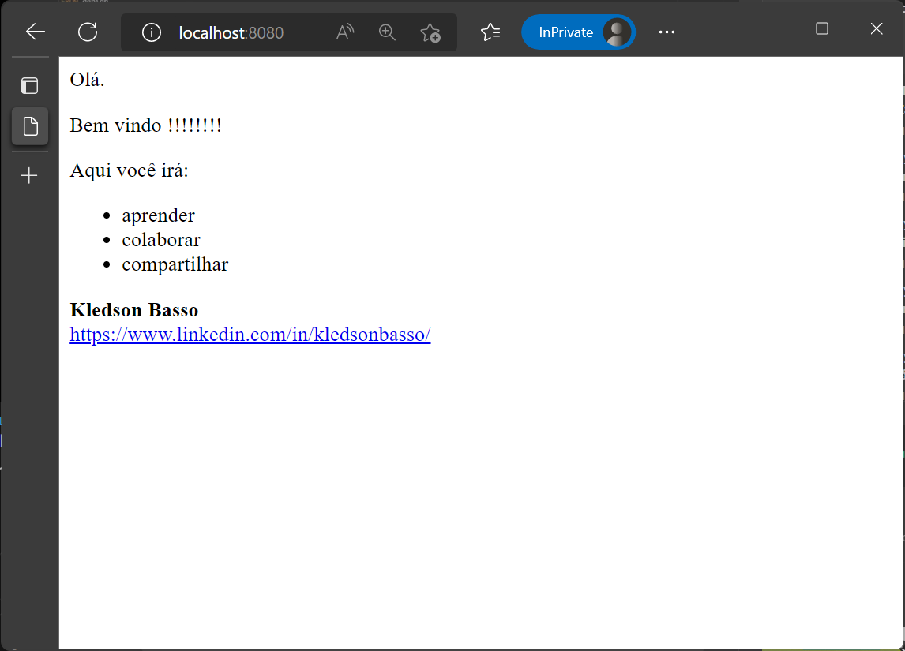

# Static Site Sample

## Container Build

```
docker image build -t kledsonhugo/static-site:1.0.0 . --no-cache
```

- Output example

  ```
  $ docker image build -t kledsonhugo/static-site:1.0.0 . --no-cache
  [+] Building 27.8s (8/8) FINISHED
   => [internal] load build definition from Dockerfile                                    0.0s
   => => transferring dockerfile: 508B                                                    0.0s
   => [internal] load .dockerignore                                                       0.0s
   => => transferring context: 2B                                                         0.0s
   => [internal] load metadata for docker.io/library/debian:latest                       12.0s
   => [internal] load build context                                                       0.0s
   => => transferring context: 1.02kB                                                     0.0s
   => CACHED [1/3] FROM docker.io/library/debian@sha256:e538a2f0566efc44db21503277c7312a  0.0s
   => [2/3] RUN apt-get update && apt-get install -y apache2 && apt-get clean            15.0s
   => [3/3] COPY app/*.html /var/www/html/                                                0.0s
   => exporting to image                                                                  0.7s
   => => exporting layers                                                                 0.7s
   => => writing image sha256:764795e7198df5651540d53a2875e656e5bbd016f73c0af62e01e8ff71  0.0s
   => => naming to docker.io/kledsonhugo/static-site:1.0.0                                0.0s
  $
  ```

## Container Run

```
docker run -d -p 8080:80 kledsonhugo/static-site:1.0.0
```

- Output example

  ```
  $ docker run -d -p 8080:80 kledsonhugo/static-site:1.0.0
  71298d943819571b3741710d33e16fc431340f6658f144f4851063f7586a4888
  $
  ```

- Check container execution

  ```
  $ docker ps -a |grep static-site
  71298d943819   kledsonhugo/static-site:1.0.0   "/usr/sbin/apachectl…"   39 seconds ago   Up 38 seconds   0.0.0.0:8080->80/tcp   inspiring_hopper
  $
  ```

- Test if Apache2 is running

  - Open browser.
  <br/><br/>
  - Navigate to http://localhost:8080.
  <br/><br/>
  - See the static page.
  <br/><br/>
     